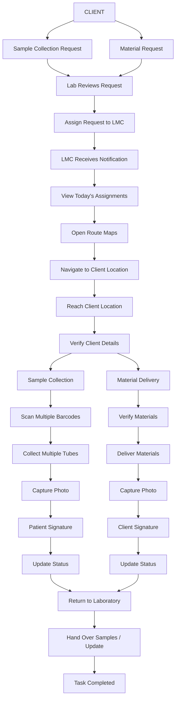

# LME (Lab Medical Executive) Mobile Application

A refined, enterprise-level mobile application designed for healthcare sample collection and material delivery. Built with a clean, professional, minimal UI using Material Design 3 and developed with React, Vite, and Tailwind CSS.

---

## 📌 Complete Workflow

The application supports **two major workflows**:
1. **Sample Collection**
2. **Material Delivery**

A **single client** can have:
- Multiple Patients
- Multiple Sample Collection Requests
- Multiple Sample Tubes
- Multiple Material Requests

### 🔄 High-Level Flow

---

## 📱 Mobile Architecture

### Bottom Navigation (5 Tabs)
- 🏠 **Home**
- 📍 **Routes**
- 📷 **Scan**
- 📦 **Tasks**
- 👤 **Profile**

### Screen Flow & Features

#### Authentication
- Splash Screen
- Login
- Sign Up
- Forgot Password

#### Home (Dashboard)
- Today's Tasks
- Pending Collections
- Material Deliveries
- Completed Jobs
- Total Samples
- Notifications
- High Priority Tasks

#### Routes
- Google Maps Integration
- Nearby Clients
- Navigation & ETA
- Traffic Updates
- Multiple Stops

#### Scan
- Supports Barcode & QR Code
- Multiple Sample Tubes Support
- Displays: Patient Details, Test Details, Tube Details, Scan Status

#### Tasks
- **Tabs:** Today's | Collections | Materials | Completed
- **Card Details:** Client Name, Client Code, Address, Patients, Sample Count, Material Count, Priority Badge, Current Status

#### Profile
- Employee Details
- Attendance & Performance
- History
- Settings
- Logout

---

## 🔬 Detailed Workflows

### 1. Sample Collection Workflow
`Client` ➔ `Lab Assignment` ➔ `LMC Accepts Task` ➔ `Navigate` ➔ `Reach Client` ➔ `Verify Client` ➔ `Select Patient` ➔ `Scan Sample Tube(s)` ➔ `All Samples Verified` ➔ `Collect Samples` ➔ `Patient Signature` ➔ `Upload Photo` ➔ `Collection Completed`

#### Multiple Sample Hierarchy Example:
```text
ABC Hospital
│
├── Patient A
│      ├── Barcode 1
│      ├── Barcode 2
│      └── Barcode 3
├── Patient B
│      ├── Barcode 4
│      └── Barcode 5
```

### 2. Material Delivery Workflow
`Client Requests Materials` ➔ `Lab Approves Request` ➔ `Pack Materials` ➔ `Assign LMC` ➔ `Navigate` ➔ `Reach Client` ➔ `Verify Client` ➔ `Deliver Materials` ➔ `Client Signature` ➔ `Photo Proof` ➔ `Delivery Completed`

---

## 📊 State Management

### Status Timeline
`Assigned` ➔ `Accepted` ➔ `On the Way` ➔ `Reached` ➔ `In Progress` ➔ `Completed`

### Notifications System
- New Assignment
- Route Changed
- High Priority Pickup
- Material Request
- Collection Reminder
- Lab Message

---

## 🎨 UI/UX & Wireframe Guidelines

This structure is designed for a professional **25–30 screen mobile wireframe** in Figma. 

**Design Principles:**
- Mobile-first layout
- Rounded cards & generous spacing
- Simple, recognizable icons
- Clear, modern typography
- Intuitive workflows optimized for fast field operations

**Key Screens to Design:**
1. Splash Screen
2. Login / Sign Up / Forgot Password
3. Home Dashboard (Cards: Today's Collections, Deliveries, Pending, Completed, Samples)
4. Today's Tasks / Client List / Client Details
5. Google Maps Navigation (Route, ETA, Pins)
6. Barcode Scanner (Multiple patients under single client)
7. Multiple Sample Collection Screen
8. Patient Sample Details
9. Material Delivery Screen
10. Delivery Confirmation & Signature
11. Notifications
12. Collection History / Reports Dashboard
13. Profile / Settings / Logout
